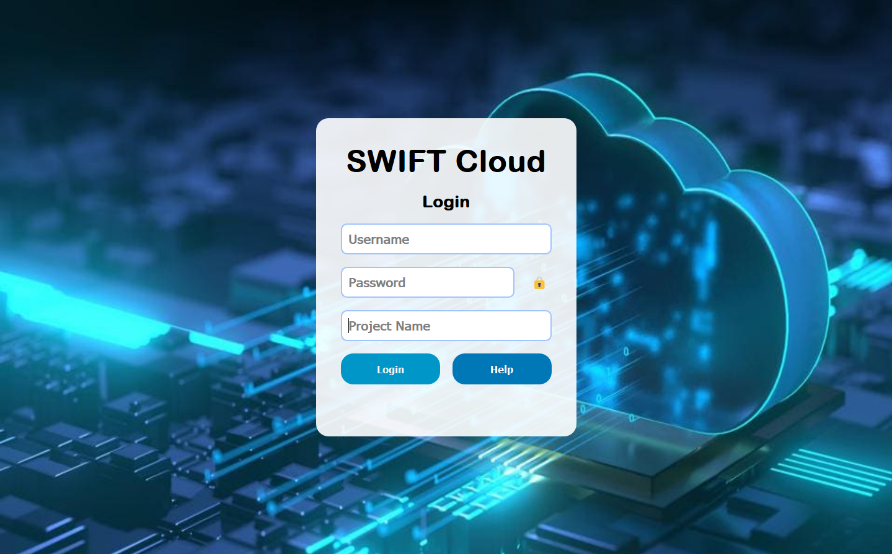
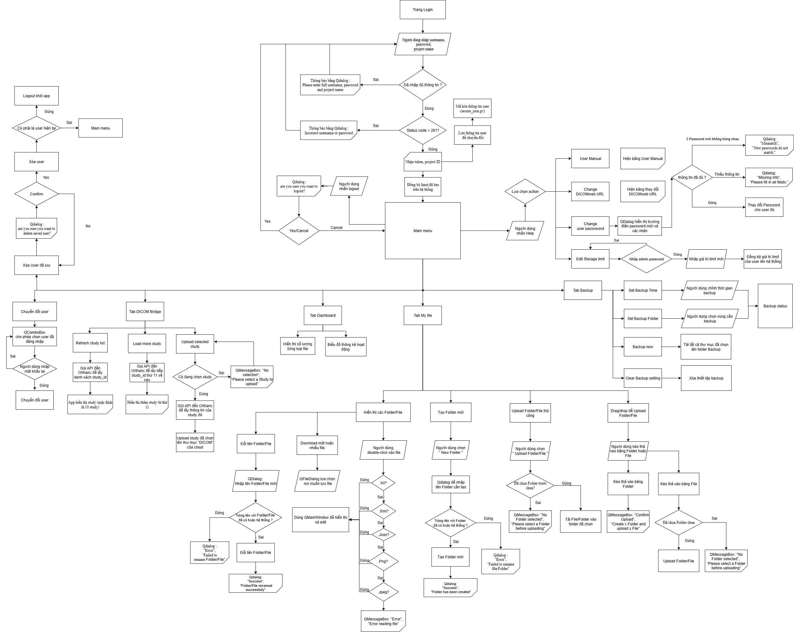

# SWIFT Cloud
---- Hướng dẫn cài đặt Devstack Openstack swift trên máy ảo cho tester ----

Bước 1: Tạo user stack và gán quyền cho user đó

`sudo useradd -s /bin/bash -d /opt/stack -m stack`

`sudo chmod +x /opt/stack`

`echo "stack ALL=(ALL) NOPASSWD: ALL" | sudo tee /etc/sudoers.d/stack`

`sudo -u stack -i`

Bước 2: Thực hiện clone mã nguồn Devstack vào user đã tạo 

`git clone https://opendev.org/openstack/devstack`

`cd devstack`

Bước 3: Vào thư mục devstack copy file local.conf đã có vào

Bước 4: Thực hiện cài đặt Devstack

`./stack.sh`

Lưu ý: Việc gán ram qua ít cho máy ảo có thể gây ra lỗi cài đặt (Tối thiểu 12 GB)

Sau khi cài đặt Terminal sẽ hiện địa chỉ IP của trang Dashboard Horizon Openstack

Địa chỉ trong hình là 192.168.1.110 

Tài khoản và mật khẩu đăng nhập mặc định là: admin/admin. 

Trong phần app đã có phần thay đổi địa chỉ này tùy vào cài đặt của từng người dùng khác nhau.

Người dùng bấm vào “Help” để tiến hành thay đổi.
# Install

* Người dùng có thể build app bằng cách chạy lệnh này trong folder "src" (Lưu ý cần phải có folder "src" và cài đặt các IDE Python cần thiết), lưu ý: lệnh có thể thay đổi tùy vào hệ điều hành mà người dùng sử dụng lệnh phía dưới chỉ áp dụng cho "Windows".

* `pyinstaller --onefile --noconsole --add-data "photos;photos" --add-binary "tools/rclone.exe;tools" --name SWIFT Cloud --icon=photos/logo.ico login.py`

---- Hướng dẫn cài đặt app SWIFT Cloud cho Windows/Linux/macOS----

Bước 1: Tải phiên bản phù hợp với hệ điều hành

Bước 2: Giải nén thư mục.

Bước 3: Người dùng có thể bắt đầu dùng app bằng cách sử dụng "SWIFT Cloud.exe" (Lưu ý thay đổi đường dẫn URL Swift trong phần Help để tránh lỗi).

# SWIFT Cloud Diagram

